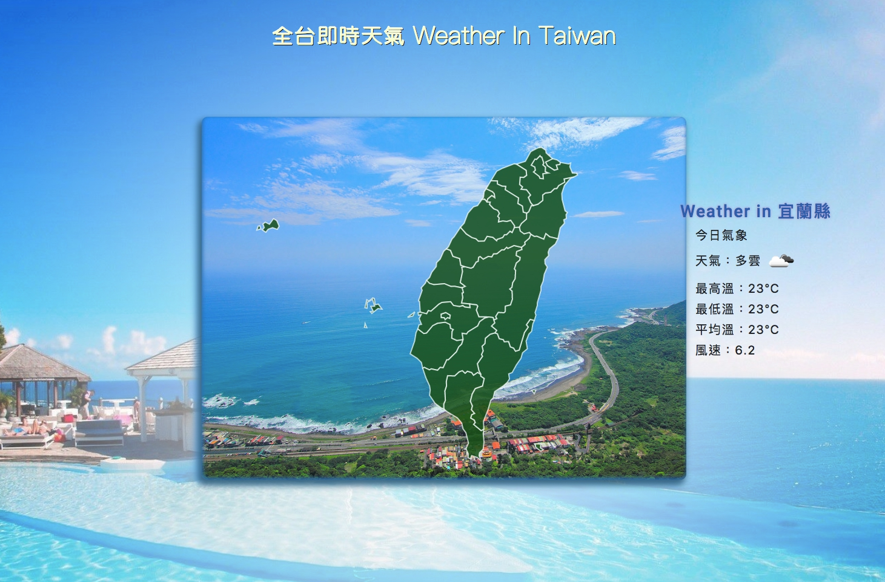
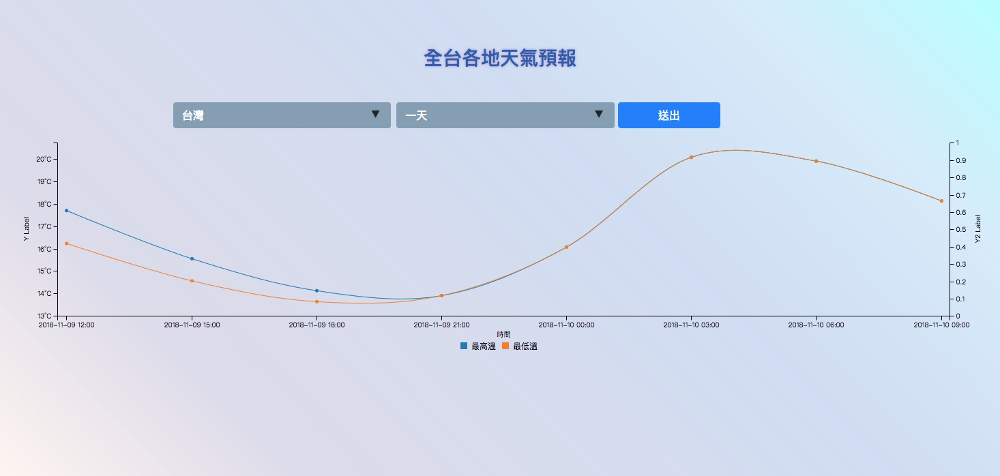

# Taiwan-weather
Taiwan weather / d3.js Vue bootstrap
-使用 D3.js 搭配 topojson.js 繪製台灣地圖
 並使用 c3.js 取得未來天氣
 Support for more than tablet (最低支援到平板以上)
- <a href="https://joechen0730.github.io/Taiwan-weather/" target="blank"><B>台灣天氣 Taiwan weather </B> (RWD)</a>  
<a href="https://joechen0730.github.io/Taiwan-weather/" target="blank"> </a>  
<a href="https://joechen0730.github.io/Taiwan-weather/" target="blank"> </a>  
